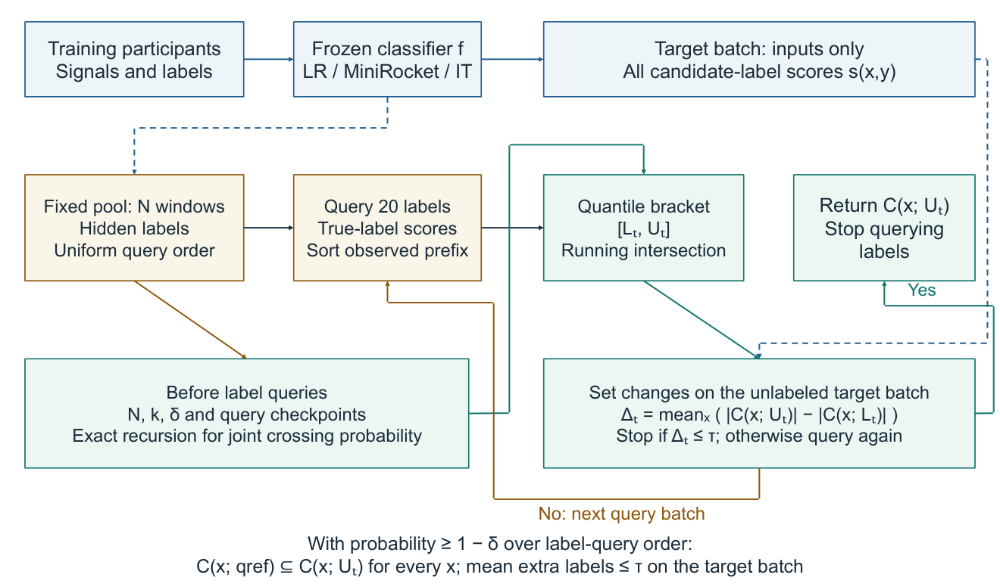

# Joint rank calibration for finite-pool reference emulation

**Label-efficient emulation of conformal reference sets for wearable activity recognition**

Research code and reproducibility materials accompanying an unpublished manuscript targeting Pattern Analysis and Applications.

[Manuscript](paper/manuscript.pdf) · [Editable architecture](figures/Fig1_editable.pptx) · [Reproduction guide](docs/REPRODUCTION.md) · [Method and scope](docs/METHOD.md) · [Data and rights](docs/DATA.md)



JRC reduces calibration-label queries while preserving a fixed reference predictor. It calibrates the joint crossing probability of finite-population rank brackets and stops when the two endpoint prediction sets differ by at most a specified mean number of labels on an unlabeled monitoring batch.

## Reported results

At confidence error 0.05 and tolerance 0.5 additional labels, USC-HAD reference-label savings are:

| Method | Labels saved |
|---|---:|
| Joint rank calibration (JRC) | 23.67% |
| Bonferroni hypergeometric intervals | 17.91% |
| Uniform-prior confidence sequence | 11.74% |
| Strongest of four tested CS priors, subsequent diagnostic | 15.33% |

The study includes seven public datasets and 354 fitted classifier cases. Six datasets were used during development/reanalysis; USC-HAD was reserved under a locally timestamped protocol before its model predictions were inspected. The stronger-prior diagnostic reuses the same models after confirmation. Repeated fits and query orders are not additional independent participants.

## Quick start

Use Python 3.12. From the repository root:

```text
python -m pip install -r requirements.txt
python get_artifacts.py
python reproduce.py --smoke
```

The artifact download is approximately 318 MB and supplies frozen predictions and evaluation records. The smoke run compares one complete acquisition case with the frozen results. For all 354 cases run `python reproduce.py`. Quantitative plots can be rebuilt with `python revision7/figures.py`; install Arial to match the distributed typography. Acquisition replay uses saved probabilities and does not require CUDA or classifier refitting.

## Repository map

| Path | Purpose |
|---|---|
| paper/ | Current review PDF and complete LaTeX source |
| figures/ | Editable architecture and vector scientific plots |
| docs/ | Reproduction, statistical scope and data provenance |
| revision6/ | Locked JRC implementation, main evaluation and summary tables |
| revision7/ | Subsequent stronger-prior diagnostic and figure builder |
| revision/, revision5/ | Shared score/model/preprocessing code and earlier-study evidence |
| artifacts.json | Versioned release URL and SHA-256 of Online Resource 1 |

The scientific directory names are retained so that imports and locked-file checksums remain stable. Results with small gains and the earlier unsuccessful acquisition study remain available in the supplement. Larger numerical files are distributed through [Releases](https://github.com/Cyrano666/har-calibration-diversity/releases), keeping the clone focused on code and readable outputs.

The guarantee is conditional on a fixed pool and uniform sampling without replacement. It preserves reference sets for every input and controls average inflation on the declared monitoring batch. It does not repair a poorly calibrated reference or establish new population coverage under arbitrary shift. Human annotation time was not measured.
